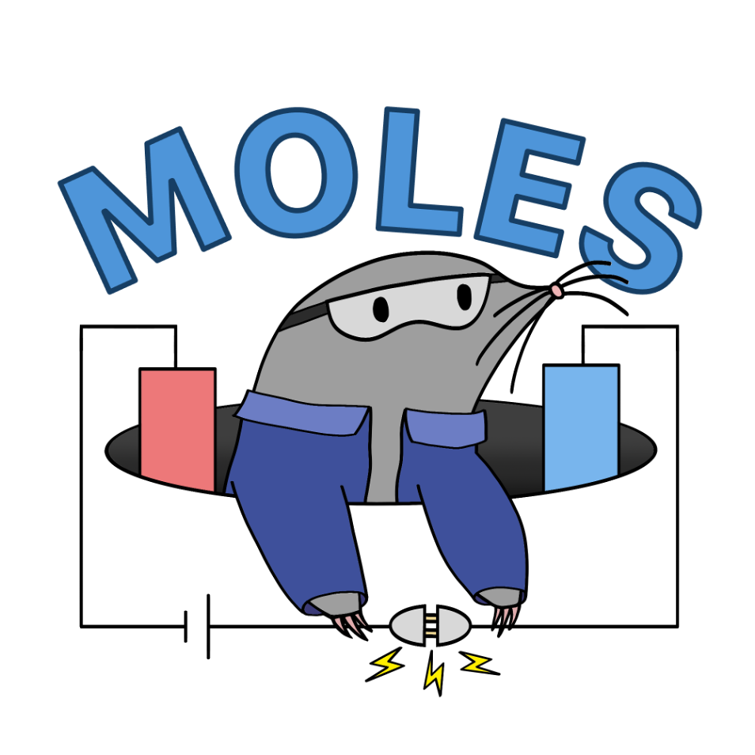

# MOLES
**M**odular **O**pen-source **L**aboratory for **E**lectrochemistry **S**creening

An affordable platform for small-scale electrosynthesis screening, enabled by an open-source potentiostat designed by the Acceleration Consortium and Matter Lab the University of Toronto (*Device*, **2025**, *3*, 100567, doi: 10.1016/j.device.2024.100567).

## Quickstart
- Clone or fork the MOLES repository.
- In your environment, run: ```pip install .``` in the terminal to install the package.
- Run the launcher with command: ```moles``` (or ```python -m moles```)
  - Shows every registered potentiostat with its live status (free, or in use by which app/experiment/user) and launches the apps below as independent processes
- Run electrolysis UI with command: ```moles-electrolysis```
  - Supported methods: **constant current**, **constant potential**, **alternating current** (up to 7 Hz via PID current control), and **alternating polarity** (up to 50 Hz via autonomous potential control)
- Run electroanalysis UI with command: ```moles-electroanalysis```
  - Tabbed interface for **cyclic voltammetry (CV)**, **differential pulse voltammetry (DPV)**, and an **analysis** workspace for overlaying, offsetting, smoothing, and labelling saved voltammograms

### Running multiple apps at once
MOLES apps can run in parallel on one machine: for example, an electrolysis experiment
on boards A–H while someone else runs CVs on board I. Serial ports are only
opened while an experiment is running, and each running experiment holds a
*claim* on its board (visible in the launcher and in each app's status
column), so starting an experiment on a board that is already in use is
refused with a message naming the current holder instead of interrupting it.
Claims left behind by a crashed app are detected automatically; the launcher's
"Force Release" button clears one manually if ever needed.

Much thanks to Sergio Pablo-García, Ángel García, Gun Deniz Akkoc, Malcolm Sim, Yang Cao, Maxine Somers, Chance Hattrick, Naruki Yoshikawa, Dominik Dworschak, Han Hao, and Alán Aspuru-Guzik for designing the first-generation open potentiostat platform that MOLES is based off.

*Note: Generative AI (Claude Code, Google Gemini, OpenAI GPT-5 Codex) was used for this project to assist with writing code.*
